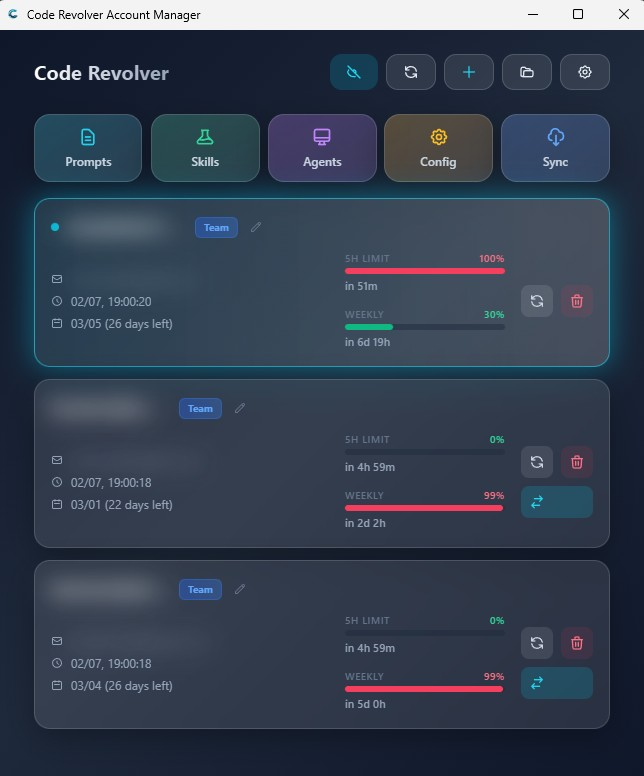

# Code Revolver 🥁🔄

> Revolver-style Codex account cylinder: load chambers, watch limits, rotate instantly.


🌍 **Language / Язык:** [English 🇬🇧](#english-) | [Русский 🇷🇺](#russian-)

## English 🇬🇧

### 🎯 What This Project Is

**Code Revolver is first and foremost an account rotation engine.**  
The app treats your Codex accounts like chambers in a revolver drum:

- 🧩 Load many `auth.json` accounts
- 📊 Track limit usage in real time
- 🔁 Rotate to the best next account when needed

### ⚙️ Revolver Flow

1. Add/import account files into the local pool.
2. Track **5-hour** and **weekly** usage windows.
3. Switch manually or let smart auto-switch rotate for you.

### 🚀 Core Features

- 🥁 Revolver-style account pool management
- 📈 Live quota and reset timers
- 🤖 Smart auto-switch with threshold control (`1%` to `50%`)
- ⚡ One-click active account replacement in `~/.codex/auth.json`
- ☁️ Optional WebDAV sync between devices
- 🎨 Unified UI based on shadcn/ui components
- 🛠 Optional extras (secondary): Prompts, Skills, `AGENTS.MD`, `config.toml`

### 🖼 Current UI



### 🧪 Quick Start

Install:
1. Download the latest `.msi` or `.exe` from Releases.
2. Install and launch.

Development:

```bash
git clone https://github.com/Javaec/Code-Revolver.git
cd Code-Revolver
npm install
npm run tauri dev
```

Requirements:
- Node.js 18+
- Rust toolchain

### 🧠 Can it be pure TypeScript?

- ❌ Not fully TS-only today: desktop backend commands are implemented via Tauri/Rust in `src-tauri/`.

### 🗂 Project Map

- `src/` - React + TypeScript UI
- `src-tauri/` - Rust + Tauri backend
- `.github/` - issue/PR templates and release workflow
- `image/README/` - screenshots

### 🤝 Contributing

See `CONTRIBUTING.md` and templates:
- `.github/ISSUE_TEMPLATE/bug_report.md`
- `.github/ISSUE_TEMPLATE/feature_request.md`
- `.github/pull_request_template.md`

## Russian 🇷🇺

### 🎯 Что Это За Проект

**Code Revolver в первую очередь про барабанную ротацию аккаунтов Codex.**  
Логика как у револьвера:

- 🧩 Загружаем набор `auth.json` аккаунтов
- 📊 Следим за лимитами в реальном времени
- 🔁 Переключаемся на лучший следующий аккаунт

### ⚙️ Как Работает «Барабан»

1. Добавляете/импортируете аккаунты в локальный пул.
2. Мониторите окна лимитов: **5 часов** и **неделя**.
3. Переключаете вручную или включаете умную авторотацию.

### 🚀 Основные Возможности

- 🥁 Пул аккаунтов с револьверным принципом
- 📈 Живые проценты квот и таймеры сброса
- 🤖 Умная авторотация с порогом (`1%` до `50%`)
- ⚡ Быстрое переключение активного аккаунта в `~/.codex/auth.json`
- ☁️ Опциональная WebDAV синхронизация
- 🎨 Единый интерфейс на базе shadcn/ui компонентов
- 🛠 Дополнительные (вторичные) инструменты: Prompts, Skills, `AGENTS.MD`, `config.toml`

### 🖼 Текущий Интерфейс


### 🧪 Быстрый Старт

Установка:
1. Скачайте актуальный `.msi` или `.exe` из Releases.
2. Установите и запустите.

Разработка:

```bash
git clone https://github.com/Javaec/Code-Revolver.git
cd Code-Revolver
npm install
npm run tauri dev
```

Требования:
- Node.js 18+
- Rust toolchain

### 🧠 Можно ли полностью перейти на TS?

- ❌ Полностью без Rust пока нельзя: backend-команды и интеграция с ОС находятся в `src-tauri/`.

### 🗂 Структура

- `src/` - интерфейс (React + TypeScript)
- `src-tauri/` - backend (Rust + Tauri)
- `.github/` - шаблоны и release workflow
- `image/README/` - скриншоты
